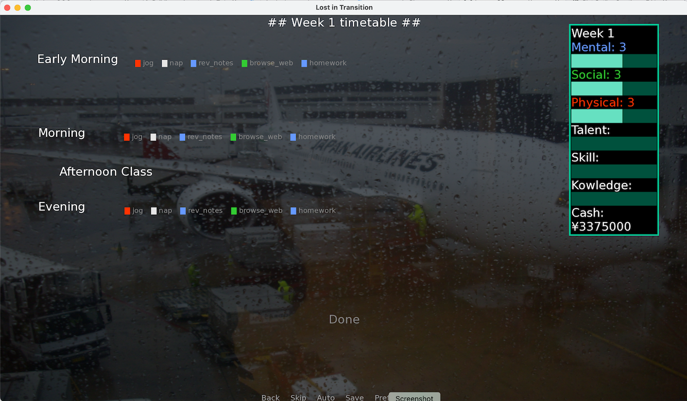
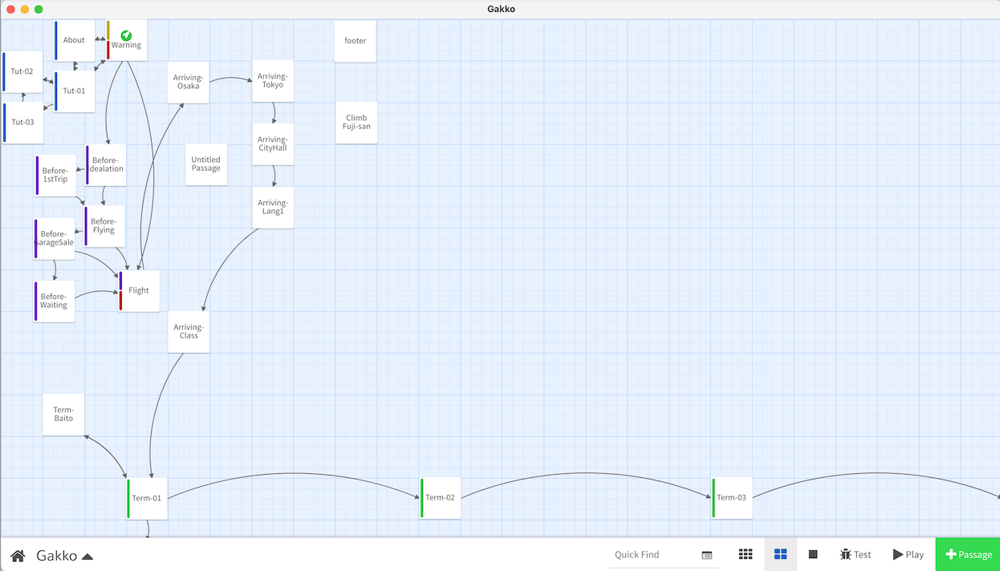

## Gakko ##

A game about traveling to Japan to study Japanese.

Written in [Twine2: Harlow3.2.2](https://twine2.neocities.org/).

I started developing this game to try plan the plot for my [Renpy](https://www.renpy.org/doc/html/) story [J-game](https://github.com/SG-mancer/J-game). 

---
### Synopsis ###
---

In Gakko the player is a young man in his late 20s who has decided to move to Tokyo to study Japanese.

He will experience the highs and lows of:
* living abroad;
* maintaining motivation;
* improving language skills; and,
* broaden his horizons.

It is a little bit of a simulator, that hopefully tells a nice rounded story.

---
### How to install/play ##
---

To play Gakko:
1. download this repo (or just copy the html file)
2. open the html file __Gakko.html__
3. Gakko will then play in your browser

---
### Development (history) ###
---

In 2019 I started making J-game. I hoped it would be a little bit like [Long live the Queen](https://games.renpy.org/game/long-live-the-queen) with the goal of choosing how you studies Japanese. 

But, after building an example of game-loop.

I felt J-game was boring, and pretty much all the choices of study ended with you failing to pass the exams. So I stopped, to re-think the story I wanted to tell with J-game.

Now in 2021, I wanted to try and flesh out the plot of J-game again. This time I decided to use Twine because developing a plot is a little easier when you can visualise the story whilst editing.

Twine also doesn't have as much coding requirement, that may be helpful in prototyping hooks/story-arcs.

---
### Ideas ###
---

#### Fast route ####
I watched a youtube video about [VN mechanics](https://youtu.be/SyAbYoC__ek?t=285) by Ashadow Reviews - that suggested giving the option to skip passages of the story. This gave me the idea to have a Fast-route, where the player can make a choice to skip to the next Plot-point.

In the text when two choices are side by side ie:

**Link 1** / **Link 2**

The Link on the right (Link 2), will skip over the next section of the story to the next plot point. Sort of like overtaking a slower car when driving in Japan.

This would allow quicker reading of the story. Though I also plan to have an achievement for finding/reading all the passages in a story (taking the longest route).